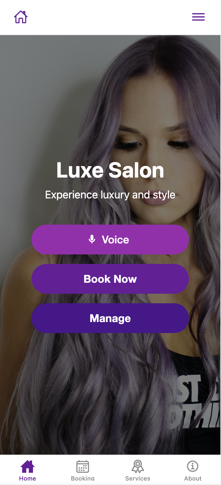
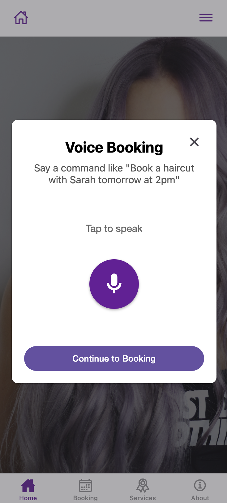
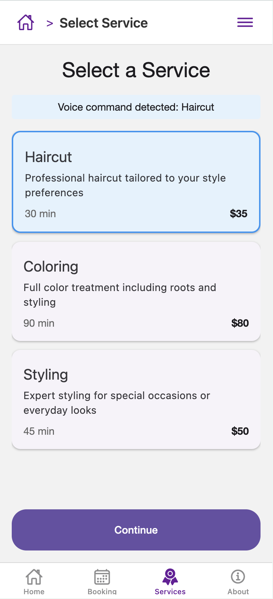
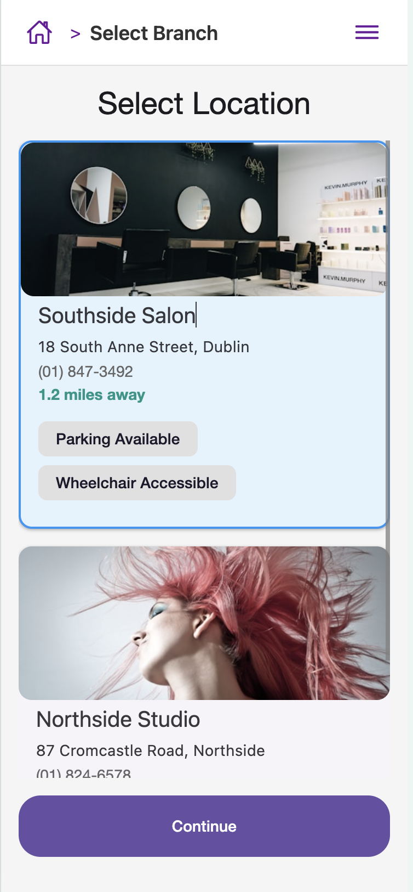
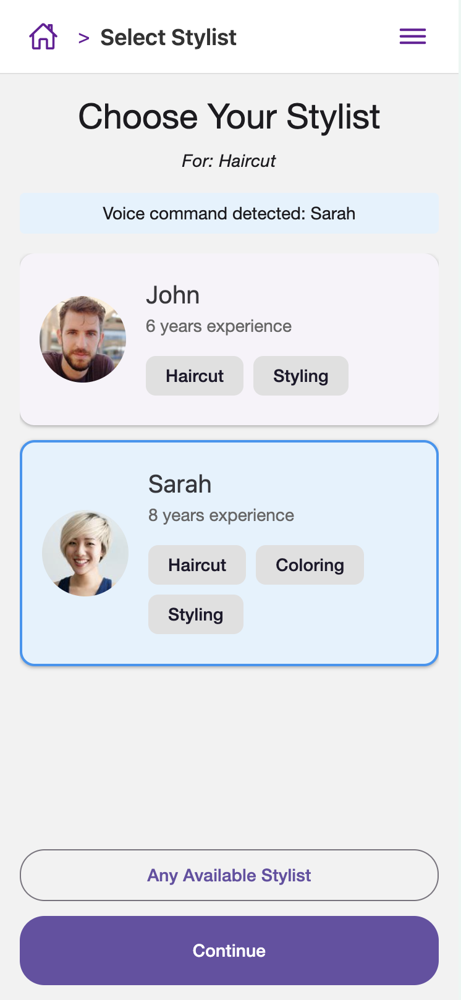
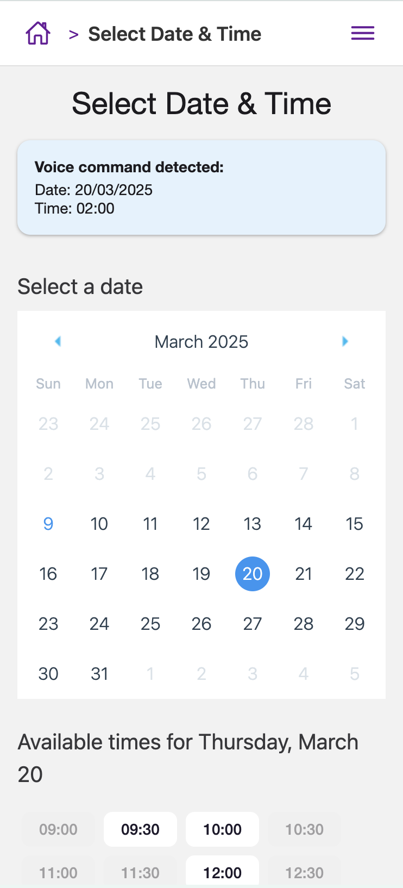
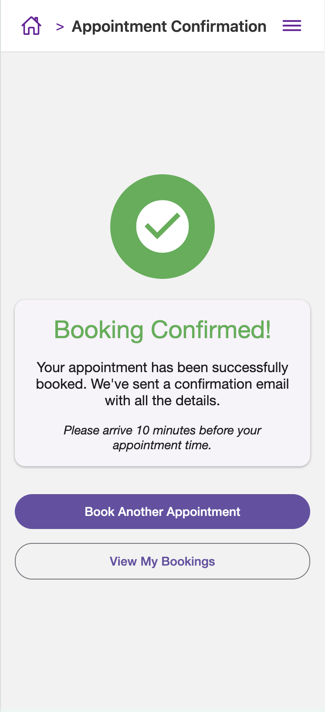
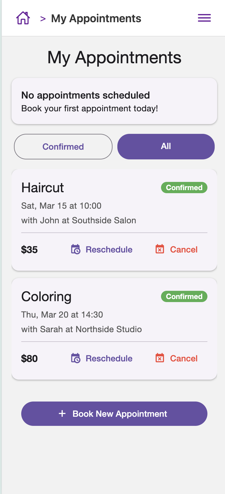
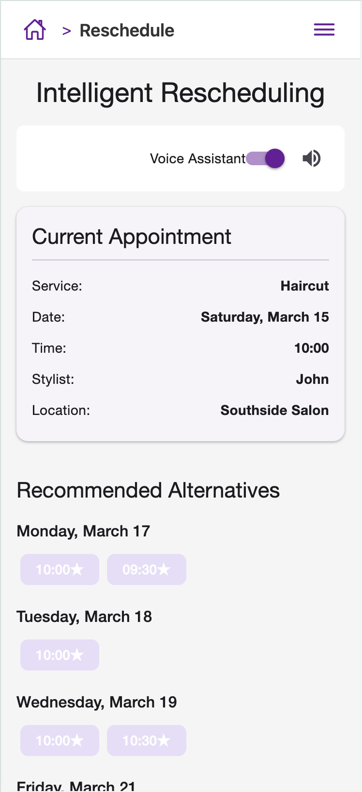
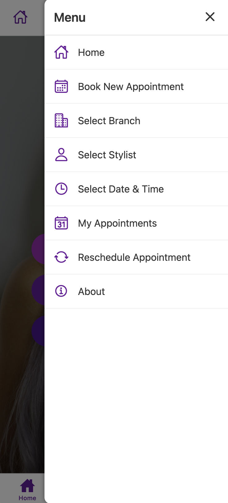

# 🎙️ Salon Voice Booking App

An AI-powered voice agent for salon bookings that transforms the traditional booking experience through natural language commands.

The Luxe Salon application has been deployed to Netlify for ease of viewing:
Please visit https://luxe-salon-application.netlify.app/ to view


<p align="center">
  
</p>

## 📋 Table of Contents

- [About](#-about)
- [Key Features](#-key-features)
- [Installation](#-installation)
- [Application Flow](#-application-flow)
- [Screenshots](#-screenshots)
- [Technical Implementation](#-technical-implementation)
- [Challenge Response](#-challenge-response)
- [Future Improvements](#-future-improvements)
- [License](#-license)
- [Contact](#-contact)

## 🚀 About

This application reimagines the salon booking experience by implementing an AI-powered voice agent that handles the entire booking process through natural voice commands. Users can book appointments by simply speaking requests like "Book a haircut with Sarah tomorrow at 2pm," and the application intelligently processes these commands to schedule appointments.

### 🎯 The Challenge

Transform the way salon bookings are made using natural voice commands to:
- Scan available slots in real-time
- Check across multiple staff members and branches
- Understand voice commands for service type, stylist preference, and scheduling
- Handle payment processing securely
- Bonus: Provide natural conversation flow and smooth handling of rescheduling/cancellations

## ✨ Key Features

- **Voice Command Recognition**: Process natural language booking requests
- **Multi-Branch Support**: Book at different salon locations
- **Stylist Selection**: Choose stylists based on expertise and availability
- **Intelligent Scheduling**: Find available time slots that match preferences
- **Appointment Management**: View, cancel, or reschedule existing bookings
- **Seamless Navigation**: Intuitive UI with hamburger menu and consistent header


## Preview
The Luxe Salon Application has been deployed to Netlify. Please visit https://luxe-salon-application.netlify.app/ to view the application

## 💻 Installation

<details>
<summary><b>Show installation instructions</b></summary>

### Prerequisites

- Node.js (v14+)
- npm or yarn
- Expo CLI

### Setup Steps

1. **Clone the repository**
   ```bash
   git clone https://github.com/Leannelb/salon-app.git
   cd salon-app
   ```

2. **Install dependencies**
   ```bash
   npm install
   # or if using yarn
   yarn install
   ```

3. **Start the application**
   ```bash
   npx expo start
   ```

4. **Run on device or emulator**
   - Press `a` to run on Android emulator
   - Press `i` to run on iOS simulator
   - Scan QR code with Expo Go app on your device

This project uses Expo Router for navigation, which provides file-based routing similar to Next.js.
</details>

## 📱 Application Flow

The application is structured with a tab-based navigation for primary screens and stack navigation for the booking flow:

### Tab Screens
- **Home** (`app/(tabs)/index.tsx`): Landing page with booking options
- **About** (`app/(tabs)/about.tsx`): Information about the salon
- **Booking** (`app/(tabs)/booking.tsx`): Voice booking interface
- **Service Selection** (`app/(tabs)/service-selection.tsx`): Browse available services

### Booking Flow Screens
1. **Service Selection**: Choose a service type
2. **Branch Selection** (`app/screens/branch-selection.tsx`): Select a salon location
3. **Stylist Selection** (`app/screens/stylist-selection.tsx`): Choose a stylist
4. **Date & Time Selection** (`app/screens/date-time-selection.tsx`): Schedule the appointment
5. **Booking Confirmation** (`app/screens/booking-screen.tsx`): Review and payment
6. **Booking Complete** (`app/screens/booking-complete.tsx`): Confirmation

### Management Screens
- **Booking Management** (`app/screens/booking-management.tsx`): View and manage appointments
- **Reschedule Assistant** (`app/screens/reschedule-assistant.tsx`): Intelligent rescheduling

### Voice Integration
The voice recognition component is implemented in `app/components/voice-recognition.tsx` and processes commands using the natural language parser in `app/utils/voice-command-parser.tsx`.

## 📸 Screenshots

### Home Screen

<p align="center">
  
  <br>
  <em>The app's landing page with voice booking, manual booking, and appointment management options.</em>
</p>

### Voice Recognition

<p align="center">
  
  <br>
  <em>Modal interface for voice commands allowing natural language booking.</em>
</p>

### Service Selection

<p align="center">
  
  <br>
  <em>Browse and select from available salon services.</em>
</p>

### Branch Selection

<p align="center">
  
  <br>
  <em>Choose from multiple salon locations with details about each.</em>
</p>

### Stylist Selection

<p align="center">
  
  <br>
  <em>Select a stylist based on specialties and availability at your chosen branch.</em>
</p>

### Date & Time Selection

<p align="center">
  
  <br>
  <em>Calendar interface to pick your preferred date and available time slots.</em>
</p>

### Booking Confirmation

<p align="center">
  
  <br>
  <em>Confirmation screen with booking details and next steps.</em>
</p>

### Booking Management

<p align="center">
  
  <br>
  <em>View, cancel, and manage your existing appointments.</em>
</p>

### Rescheduling Assistant

<p align="center">
  
  <br>
  <em>Intelligent suggestions for alternative appointment times when rescheduling.</em>
</p>

### Hamburger Meny

<p align="center">
  
  <br>
  <em>Hamburger menu for accessing pages of the application</em>
</p>

## 🔧 Technical Implementation

### Architecture

```
├── app/                         # Main application structure
│   ├── (tabs)/                  # Tab-based navigation screens
│   │   ├── _layout.tsx          # Tab navigation configuration
│   │   ├── index.tsx            # Home screen
│   │   ├── about.tsx            # About page
│   │   ├── booking.tsx          # Voice booking entry point
│   │   └── service-selection.tsx # Service selection tab
│   ├── screens/                 # Application screens
│   │   ├── booking-complete.tsx      # Confirmation screen
│   │   ├── booking-management.tsx    # Appointment management
│   │   ├── booking-screen.tsx        # Main booking interface
│   │   ├── branch-selection.tsx      # Salon location selection
│   │   ├── date-time-selection.tsx   # Scheduling interface
│   │   ├── reschedule-assistant.tsx  # Intelligent rescheduling
│   │   └── stylist-selection.tsx     # Stylist selection
│   ├── components/              # Reusable UI components
│   │   └── voice-recognition.tsx # Voice command interface
│   ├── utils/                   # Helper functions
│   │   ├── voice-command-parser.tsx # NLP for voice commands
│   └── _layout.tsx              # Root navigation setup
├── assets/                      # Static resources
│   ├── images/                  # Image files
│   │   ├── salon-bg.jpeg        # Background image for home
│   │   └── favicon.png          # App icon
│   └── fonts/                   # Custom fonts
└── package.json                 # Project dependencies
```

### Key Components

#### Voice Recognition System
```tsx
// app/components/voice-recognition.tsx
export default function VoiceRecognition({ onResult }) {
  const [isListening, setIsListening] = useState(false);
  
  // Speech recognition implementation
  // Process voice input and extract booking information
}
```

#### Natural Language Processing
```tsx
// app/utils/voice-command-parser.tsx
export function parseVoiceCommand(text: string): CommandResult {
  // Detect booking intent (book, reschedule, cancel)
  // Extract service type (haircut, coloring, styling)
  // Identify stylist preference
  // Parse date and time
}
```

#### Navigation System
```tsx
// app/_layout.tsx
export default function RootLayout() {
  return (
    <PaperProvider>
      <Stack screenOptions={{
        header: (props) => <CustomHeader {...props} />
      }}>
        {/* Screen definitions */}
      </Stack>
    </PaperProvider>
  );
}
```

## 🏆 Challenge Response

This project successfully addresses all core requirements of the challenge while adding several extra features:

### Core Requirements Met

- ✅ **Voice Command Processing**: Implemented natural language parsing for booking commands
- ✅ **Multi-Location Support**: Added branch selection to filter stylists by location
- ✅ **Service & Stylist Selection**: Voice commands can specify service and stylist preferences
- ✅ **Date & Time Selection**: Calendar interface with available time slots
- ✅ **Payment Processing**: Secure checkout form with mock payment processing

### Above and Beyond

1. **Intelligent Rescheduling Assistant**: 
   - Suggests alternative times based on original booking preferences
   - Prioritizes similar times and same stylist availability

2. **Enhanced Navigation**: 
   - Consistent header with home button across all screens
   - Global access to all features via hamburger menu
   - Tab-based navigation for main sections

3. **Responsive Voice Interface**:
   - Modal approach keeps UI clean
   - Adapts to screen sizes with appropriate text truncation
   - Provides clear feedback on recognized commands

4. **Visual Polish**:
   - Visually appealing design with custom color scheme
   - Status indicators for appointment states
   - Consistent styling throughout the application

## 🔮 Future Improvements

### Technical Enhancements

<details>
<summary><b>Advanced Voice Processing</b></summary>

Implementing more sophisticated NLP:
```typescript
// Enhanced NLP with better context understanding
function enhancedVoiceProcessing(text) {
  // Use a more robust NLP library
  const nlp = require('advanced-nlp-library');
  
  // Process with context awareness
  const result = nlp.processWithContext(text, userPreferences);
  
  // Handle complex queries with multiple intents
  return result;
}
```
</details>

<details>
<summary><b>Backend Integration</b></summary>

Connecting to a real salon management system:
```typescript
// API service for real backend integration
class SalonApiService {
  async getAvailableSlots(date, stylistId, serviceId) {
    const response = await fetch(`${API_URL}/slots`, {
      method: 'POST',
      body: JSON.stringify({ date, stylistId, serviceId })
    });
    return response.json();
  }
  
  async bookAppointment(bookingData) {
    // Real booking implementation
  }
}
```
</details>

<details>
<summary><b>Payment Integration</b></summary>

Integrating a real payment gateway:
```typescript
// Stripe payment integration
import { StripeProvider, CardField, useStripe } from '@stripe/stripe-react-native';

function PaymentScreen() {
  const { confirmPayment } = useStripe();
  
  const handlePayment = async () => {
    // Process actual payment
    const { paymentIntent, error } = await confirmPayment(clientSecret);
    
    if (error) {
      // Handle payment error
    } else if (paymentIntent) {
      // Payment successful
    }
  };
}
```
</details>

### Feature Enhancements

1. **User Profiles & Authentication**:
   - Save favorite stylists and services
   - View booking history
   - Personalized recommendations

2. **Push Notifications**:
   - Appointment reminders
   - Special offers and promotions
   - Booking confirmations

3. **Enhanced Voice Conversations**:
   - Multi-turn conversations for booking
   - Clarification questions for ambiguous requests
   - Natural voice feedback throughout the flow

4. **Analytics Dashboard**:
   - For salon owners to track booking patterns
   - Staff performance metrics
   - Popular services and peak times

## 📄 License

This project is created for demonstration purposes as part of a job interview challenge.

## 📞 Contact

For any questions about this project, please reach out to me at leannelaceybyrne@outlook.com

---

<p align="center">⭐ If you like this project, please star it on GitHub! ⭐</p>